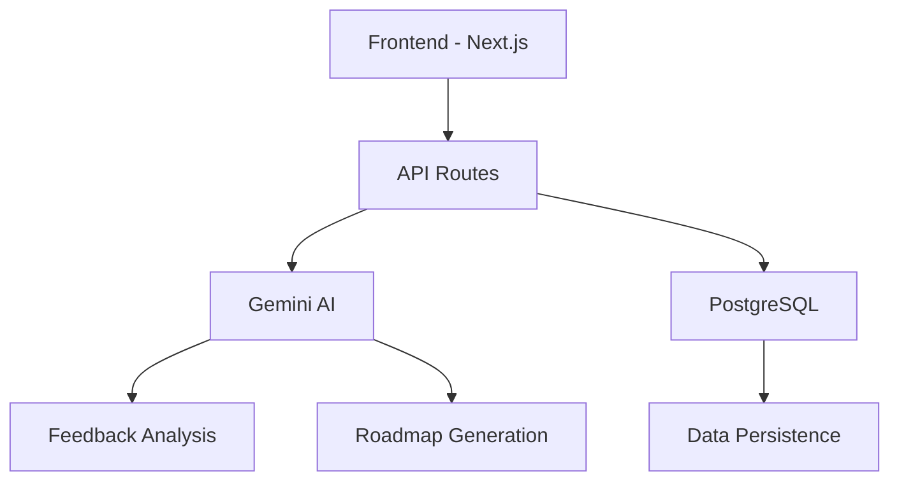
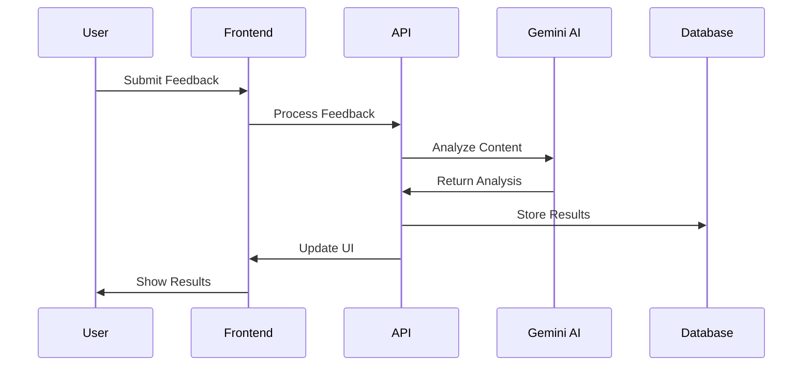

# 🎯 Feedback-Driven Product Roadmap Generator

<div align="center">
  

[](https://nextjs.org)
[](https://deepmind.google/technologies/gemini/)
[](https://www.postgresql.org)
[](https://tailwindcss.com)

*Transform customer feedback into actionable product strategies using AI* 🚀
</div>

## 🌟 Overview

This project, developed for the Google Cloud Gemini Hackathon, revolutionizes product management by intelligently processing customer feedback to generate data-driven roadmaps. It combines the power of AI with strategic planning to create a comprehensive product development strategy.

### 🎥 Demo


## ✨ Features

### 1. Smart Feedback Analysis 📊
- Processes customer conversations using Gemini AI
- Categorizes feedback into features, bugs, and improvements
- Analyzes sentiment and urgency
- Identifies emerging patterns and trends

### 2. AI-Powered Roadmap Generation 🗺️
- Creates strategic roadmaps based on feedback analysis
- Balances customer needs with business goals
- Suggests alternative approaches and strategies
- Prioritizes features based on impact and feasibility

### 3. Interactive Visualization 📈
- Multiple view options:
    - Timeline View 📅
    - Kanban Board 📋
    - Network Graph 🕸️
    - Calendar View 📆
- Real-time updates and filtering
- Drag-and-drop interface

### 4. Detailed Analysis Dashboard 🔍
- Market analysis
- Team perspectives
- Implementation risks
- Resource requirements
- User impact assessment

## 🛠️ Technology Stack



- **Frontend**: Next.js, TailwindCSS, shadcn/ui
- **Backend**: Next.js API Routes
- **Database**: PostgreSQL with Prisma
- **AI**: Google Gemini
- **Visualization**: Recharts, ReactFlow

## 🚀 Getting Started

1. **Clone & Install**
   ```bash
   git clone [repository-url]
   cd [project-directory]
   npm install
   ```

2. **Environment Setup**
   ```bash
   cp .env.example .env
   # Add your environment variables
   ```

3. **Database Setup**
   ```bash
   npx prisma migrate dev
   npm run db:seed
   ```

4. **Run the Application**
   ```bash
   npm run dev
   ```

## 💡 Key Features Walkthrough

### 1. Feedback Analysis
```typescript
// Example of how feedback is processed
const analysis = await analyzeFeedback({
  conversations: customerFeedback,
  timeRange: '30d'
});
```

### 2. Roadmap Generation
```typescript
// Example of roadmap generation
const roadmap = await generateRoadmap({
  feedbackAnalysis,
  companyContext,
  constraints
});
```

### 3. Detailed Analysis
```typescript
// Example of detailed analysis
const detailedAnalysis = await analyzeFeature({
  feature,
  marketContext,
  resources
});
```

## 📊 System Architecture



## 🤝 Contributing

Contributions are welcome! Please check our [Contributing Guidelines](CONTRIBUTING.md) for more details.

## 📝 License

This project is licensed under the MIT License - see the [LICENSE](LICENSE) file for details.

## 🌟 Acknowledgments

- Google Cloud Gemini team for the amazing API
- The open-source community for inspiration
- Our users for valuable feedback

## 📧 Contact

For questions or feedback, please contact:
- Email: your.email@example.com
- Twitter: [@yourhandle](https://twitter.com/yourhandle)

---

<div align="center">
  <sub>Built with ❤️ for the Google Cloud Gemini Hackathon</sub>
</div>